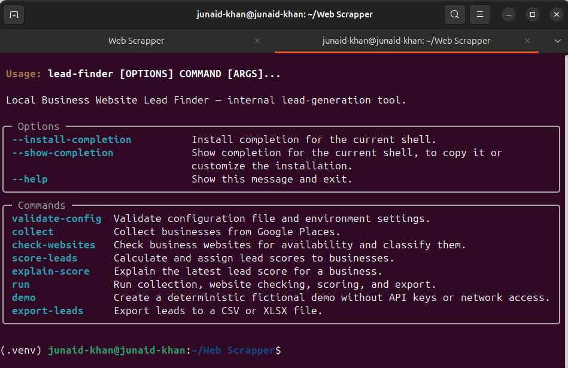
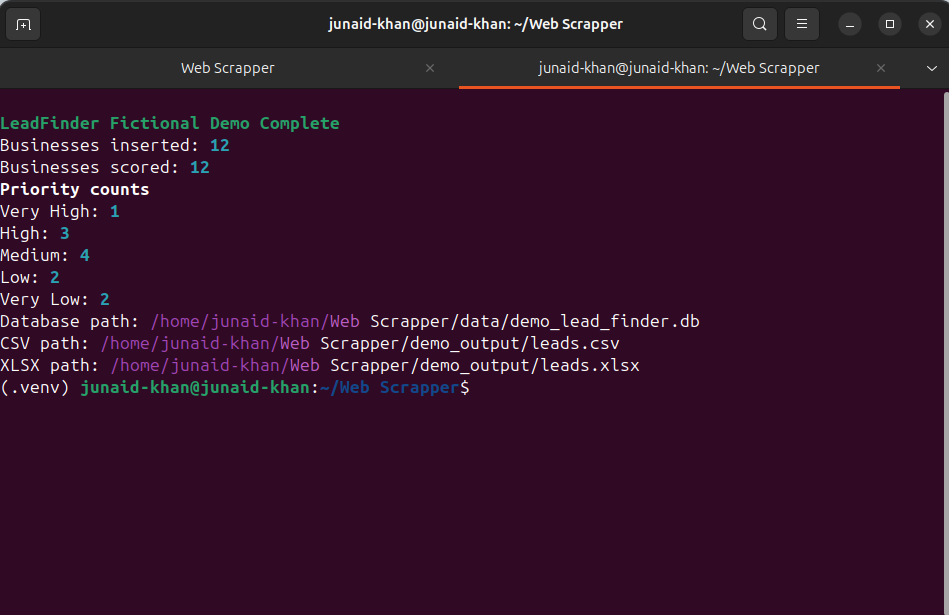
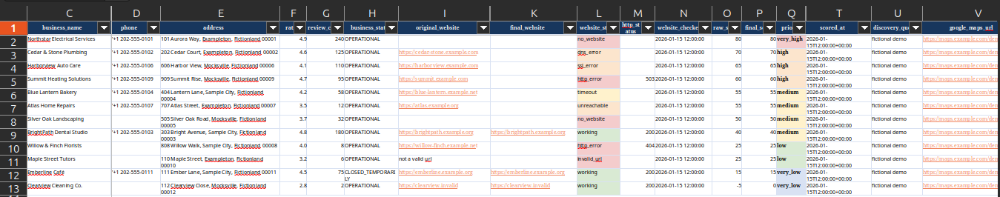
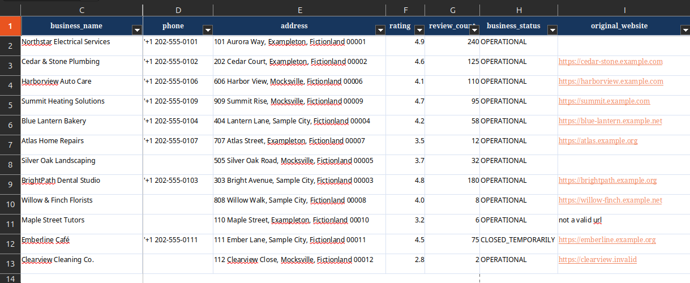
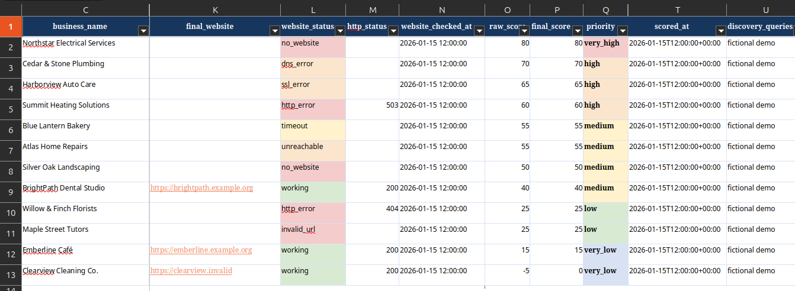
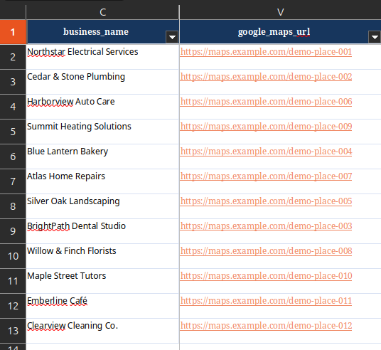

# LeadFinder CLI

[](https://github.com/junnaid-4/leadfinder-cli/actions/workflows/ci.yml)

[](LICENSE)


A production-style Python CLI for turning local-business data into structured, prioritized lead reports.

## Overview

LeadFinder collects local businesses from Google Places, checks website availability and health, calculates configurable lead-opportunity scores, and stores historical results in SQLite. It exports prioritized CSV files and professionally formatted XLSX workbooks for review.

The project emphasizes deterministic processing, explainable scoring, safe spreadsheet output, strict typing, and automated testing.

## Quick Demo

```bash
lead-finder demo --config config.demo.yaml --overwrite
```

The demo requires no API key and performs no network requests. It processes 12 deterministic fictional businesses and generates a dedicated SQLite database, a CSV report, and a formatted XLSX report under `demo_output/`. The checked-in demo configuration restricts replacement to protected demo-owned paths.

*CLI command overview*



*Network-free fictional demo output*



## Pipeline

```text
Collect → Check Websites → Score Leads → Export Reports
```

Each stage is also available as a standalone command, while `lead-finder run` executes the complete real-data pipeline.

## Excel Report Preview

The formatted workbook keeps business names visible while scrolling, highlights lead priority and website status, and retains technical fields in hidden columns for deeper inspection.

*Business details*



*Website analysis*



*Lead scoring*



*Export and source details*



## Current Status

**Version:** `0.5.0`

The current implementation includes:

* Google Places business collection
* Configurable YAML settings
* SQLite storage and schema migrations
* Concurrent website availability checks
* Configurable lead scoring
* Score explanations and history
* Prioritized CSV exports
* Professionally formatted, prioritized XLSX exports
* Zero-key, network-free fictional demo mode
* Full-pipeline `run` orchestration
* Atomic file writing
* Spreadsheet formula-injection protection
* Ruff linting
* MyPy type checking
* 150 automated tests

## Features

### Business collection

Collects local-business records using configurable search queries and locations.

Supported business information may include:

* Business name
* Place ID
* Address
* Phone number
* Website
* Rating
* Review count
* Business status
* Discovery query
* Google Maps URL

The availability of individual fields depends on the data provider.

### Website checking

Checks business websites and stores historical results.

Website classifications include:

* Working
* No website
* Unreachable
* DNS error
* SSL error
* Timeout
* Redirect loop
* Blocked
* Invalid URL
* HTTP error
* Unknown error

### Lead scoring

Businesses are assigned a configurable opportunity score based on signals such as:

* Missing website
* Website errors
* Phone availability
* Address availability
* Rating
* Review count
* Business status

Each scoring result stores:

* Raw score
* Final score
* Priority
* Scoring version
* Score breakdown
* Scoring timestamp

Priority levels:

```text
very_high
high
medium
low
very_low
```

### Structured exports

LeadFinder CLI exports the latest business, website-check, and lead-score data to:

* CSV
* XLSX

Exports include deterministic sorting, configurable filters, stable column ordering, spreadsheet formula-injection protection, atomic single-file replacement, and coordinated pair-level replacement when both formats are requested.

## Requirements

* Python 3.12 or newer
* Git
* A Google Places API key for Google-based collection
* A billing-enabled Google Cloud project when using Google Places

The website-checking, scoring, and export stages can operate on records already present in the database.

## Installation

Clone the repository:

```bash
git clone git@github.com:junnaid-4/leadfinder-cli.git
cd leadfinder-cli
```

Create a virtual environment:

```bash
python3 -m venv .venv
source .venv/bin/activate
```

Install the project:

```bash
python -m pip install --upgrade pip
python -m pip install -e .
```

For development:

```bash
python -m pip install -e ".[dev]"
```

Confirm the CLI is installed:

```bash
lead-finder --help
```

## Configuration

Copy the example configuration:

```bash
cp config.example.yaml config.yaml
```

Create a local environment file:

```bash
cp .env.example .env
```

Add your API key to `.env`:

```env
GOOGLE_MAPS_API_KEY=your_api_key_here
```

Never commit `.env`, `config.yaml`, local databases, or exported lead files.

Example configuration:

```yaml
project:
  name: "Manchester Electrician Leads"

search:
  location: "Manchester, UK"
  queries:
    - "electricians in Manchester"
    - "electrical contractors in Manchester"
    - "emergency electricians in Manchester"

database:
  path: "data/lead_finder.db"

logging:
  level: "INFO"
  directory: "logs"
  console: true

export:
  default_format: "csv"
  output_directory: "exports"
  include_unscored: false
  minimum_score: 0
  priorities: []
```

Refer to `config.example.yaml` for the complete configuration structure.

## Usage

### Validate configuration

```bash
lead-finder validate-config --config config.yaml
```

### Run the full pipeline

```bash
lead-finder run --config config.yaml --format both
```

The pipeline validates configuration, collects businesses, checks websites, scores leads, and exports reports. Use `--format csv`, `--format xlsx`, or `--format both`; `--output-dir PATH` overrides the export directory; `--force-refresh` bypasses cached collection and analysis data; and `--overwrite` authorizes replacement of existing export files.

Preview limits and planned stages with no API calls, HTTP requests, database creation, logging, or exports:

```bash
lead-finder run --config config.yaml --dry-run --format both
```

### Collect businesses

```bash
lead-finder collect --config config.yaml
```

This stage requires valid provider credentials.

### Check websites

```bash
lead-finder check-websites --config config.yaml
```

Use force refresh when existing checks should be repeated:

```bash
lead-finder check-websites \
  --config config.yaml \
  --force-refresh
```

### Score leads

```bash
lead-finder score-leads --config config.yaml
```

Recalculate existing scores:

```bash
lead-finder score-leads \
  --config config.yaml \
  --force-refresh
```

### Explain a score

```bash
lead-finder explain-score \
  --config config.yaml \
  BUSINESS_ID
```

Replace `BUSINESS_ID` with the database ID of a business.

### Export to CSV

```bash
lead-finder export-leads \
  --config config.yaml \
  --format csv \
  --output exports/leads.csv
```

### Export to Excel

```bash
lead-finder export-leads \
  --config config.yaml \
  --format xlsx \
  --output exports/leads.xlsx
```

Overwrite an existing export:

```bash
lead-finder export-leads \
  --config config.yaml \
  --format xlsx \
  --output exports/leads.xlsx \
  --overwrite
```

## Export Filters

Set a minimum score:

```bash
lead-finder export-leads \
  --config config.yaml \
  --min-score 40
```

Export a specific priority:

```bash
lead-finder export-leads \
  --config config.yaml \
  --priority high
```

Limit the number of exported leads:

```bash
lead-finder export-leads \
  --config config.yaml \
  --limit 100
```

Include businesses without a score:

```bash
lead-finder export-leads \
  --config config.yaml \
  --include-unscored
```

CLI options override values defined in `config.yaml`.

## Exported Fields

Exports may contain:

```text
business_id
place_id
business_name
phone
address
rating
review_count
business_status
original_website
normalized_website
final_website
website_status
http_status
website_checked_at
raw_score
final_score
priority
scoring_version
score_breakdown
scored_at
discovery_queries
google_maps_url
```

## Development

Activate the environment:

```bash
source .venv/bin/activate
```

Run all tests:

```bash
pytest -q
```

Run the test suite twice when verifying deterministic behavior:

```bash
pytest -q
pytest -q
```

Run Ruff:

```bash
ruff check .
```

Automatically fix supported linting issues:

```bash
ruff check . --fix
```

Check formatting:

```bash
ruff format --check .
```

Run MyPy:

```bash
mypy src
```

Check for whitespace errors:

```bash
git diff --check
```

Complete local verification:

```bash
pytest -q
ruff check .
ruff format --check .
mypy src
git diff --check
```

## Project Structure

```text
leadfinder-cli/
├── src/
│   └── lead_finder/
│       ├── cli.py
│       ├── config.py
│       ├── database.py
│       ├── exporter.py
│       ├── lead_scoring.py
│       ├── pipeline.py
│       ├── demo_data.py
│       ├── places_client.py
│       ├── website_checker.py
│       └── ...
├── tests/
├── data/
├── exports/
├── logs/
├── config.example.yaml
├── config.demo.yaml
├── pyproject.toml
├── README.md
└── LICENSE
```

Local contents of `data/`, `exports/`, and `logs/` are intentionally excluded from Git.

## Data Safety

LeadFinder CLI does not automatically send emails, messages, or outreach.

The application:

* Does not invent email addresses
* Does not automatically contact businesses
* Does not export environment variables
* Does not include API keys in reports
* Does not overwrite exports without explicit permission
* Does not modify business records during export

## Responsible Use

This project is intended for lawful business research, internal analysis, and lead qualification.

Users are responsible for:

* Following the terms of each data provider
* Respecting website terms and robots policies
* Complying with privacy and data-protection laws
* Complying with anti-spam and electronic-marketing laws
* Avoiding excessive requests to third-party services
* Protecting API keys, databases, and exported business data

Google Places is an external service and is not affiliated with, endorsed by, or bundled with this project.

## Known Limitations

* Google Places collection requires valid credentials and billing.
* Data quality depends on the selected provider.
* Some businesses may not include websites, phone numbers, ratings, or review counts.
* The current interface is command-line based.
* There is no automatic outreach functionality.
* There is currently no hosted web dashboard.
* SQLite is intended primarily for local use.
* Demo results are synthetic and do not represent live market data.

## Roadmap

Planned improvements include:

* Alternative business-data providers
* CSV business import
* Additional scoring signals
* Contact-page discovery
* FastAPI backend
* React or Next.js dashboard
* PostgreSQL support
* Background job processing
* Hosted demonstration

## Web Application Direction

The existing Python modules can later be exposed through a backend API:

```text
React / Next.js frontend
          ↓
FastAPI backend
          ↓
LeadFinder business logic
          ↓
SQLite or PostgreSQL
```

The frontend should never receive private API keys directly.

## Contributing

Contributions, bug reports, documentation improvements, and feature suggestions are welcome.

Before submitting changes:

```bash
pytest -q
ruff check .
ruff format --check .
mypy src
git diff --check
```

A dedicated contribution guide will be added in `CONTRIBUTING.md`.

## Security

Do not include API keys, access tokens, production databases, or real lead exports in public issues.

Security problems should be reported privately rather than disclosed in a public issue.

## License

This project is available under the MIT License.

See `LICENSE` for details.

## Author

**Junaid Khan**

Computer Science student and developer interested in artificial intelligence, automation, backend engineering, and practical business systems.

* GitHub: `@junnaid-4`
* Project: LeadFinder CLI

---

Built as a practical engineering project focused on modular architecture, deterministic behavior, testability, data safety, and real-world automation.
